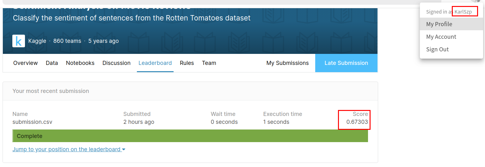
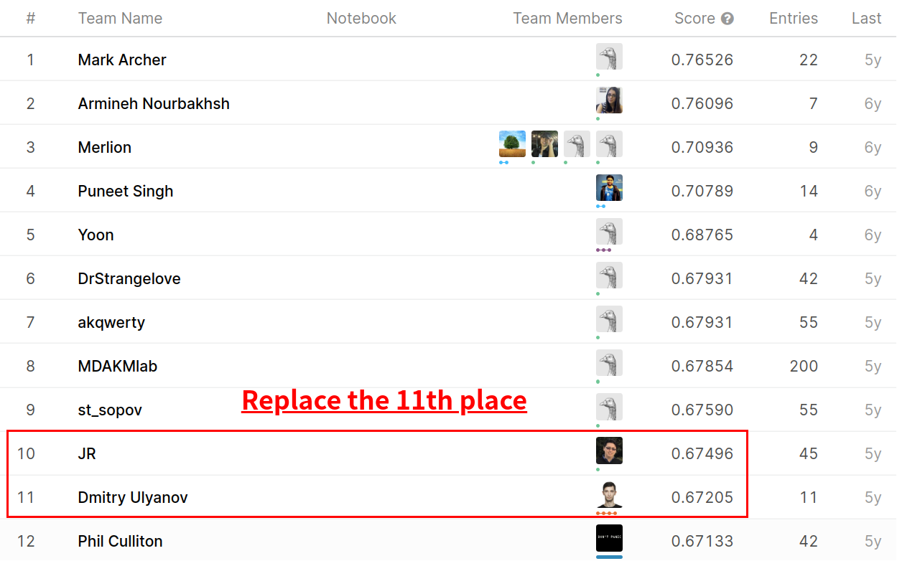
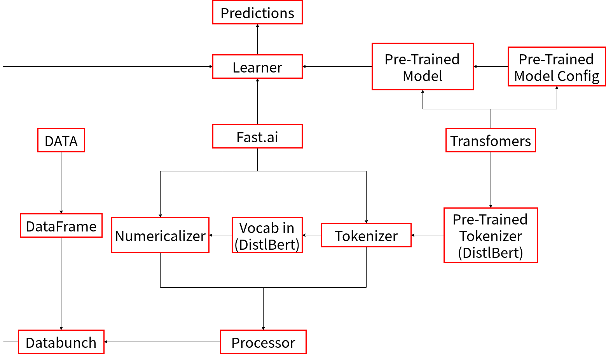
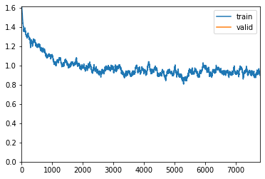
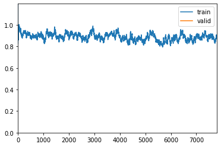
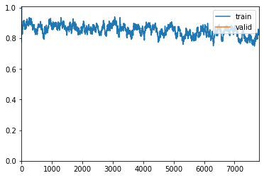
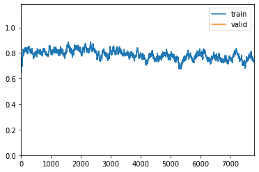

# Sentiment Analysis on Movie Reviews

>   Classify the sentiment of sentences from the Rotten Tomatoes dataset

[Kaggle Competition Page](https://www.kaggle.com/c/sentiment-analysis-on-movie-reviews/)

[toc]

## 0 Abstract


The dataset is comprised of tab-separated files with phrases from the Rotten Tomatoes dataset. The train/test split has been preserved for the purposes of benchmarking, but the sentences have been shuffled from their original order. Each Sentence has been parsed into many phrases by the Stanford parser. Each phrase has a PhraseId. Each sentence has a SentenceId. Phrases that are repeated (such as short/common words) are only included once in the data.

`train.tsv` contains the phrases and their associated sentiment labels. We have additionally provided a SentenceId so that you can track which phrases belong to a single sentence.\
`test.tsv` contains just phrases. You must assign a sentiment label to each phrase.

The sentiment labels are:

- 0 - negative
- 1 - somewhat negative
- 2 - neutral
- 3 - somewhat positive
- 4 - positive

---

**This Notebook will step on with these pipelines:**

1. `Data File` $\rightarrow$ `pd.DataFrame` $\rightarrow$ `databunch(fast.ai)`


2. `pre-trained tokenizer(DistilBert)` $\rightarrow$ `Wrapped tokenizer` $\rightarrow$ `TokenizeProcessor(fast.ai)`


3. `Vocab from pre-trained tokenizer(DistilBert)` $\rightarrow$ `Wrapped Vocab` $\rightarrow$ `NumericalizeProcessor(fast.ai)`


4. `Combine(2&3)` $\rightarrow$ `fastai_processor : [TokenizeProcessor, NumericalizeProcessor]`


5. `Learner(fast.ai)` $\rightarrow$ `Splitted Learner` $\rightarrow$ `PROGRESSIVELY-FREEZING-LAYERS Training`$^{[1]}$ $\rightarrow$ `Well-trained Model`

---

<div style="page-break-after: always;"></div>

**Preview on scores - @KarlSzp**





---

**Environment**

**System Info.**

| OS      | **Ubuntu 18.04.4 LTS**                        |
| ------- | --------------------------------------------- |
| **CPU** | **Intel(R) Core(TM) i7-7700HQ CPU @ 2.80GHz** |
| **GPU** | **GTX 1050**                                  |

**Dev Tools**

* Jupyter Notebook
* python 3.7
* Google Colab

<div style="page-break-after: always;"></div>

This report(readme) is exported from Jupyter Notebook, if possible, for your better experience, please refer to the `Jupyter Notebook File (fast.ai + transfomers.ipynb)`, thanks!

## 1 Imports & Definitions

This Notebook takes the advantage of the state-of-art technique:

1. `transformers`

    transformers provides many effective pre-trained models and tokenizers for text-relative tasks.
    In this notebook, I use DistilBert.$^{[2]}$
    DistilBERT, a distilled version of BERT: smaller, faster, cheaper and lighter

2. `fast.ai`

    fast.ai provides an intergrated model `Learner()`, 
    which helps tune pre-trained model(from transformer)
    and the classifier layer added.


3. `Frame base: Pytorch`

    Wrapped model is inherited from `nn.Module`, as usual.

---

**Structure Chart**



---

<div style="page-break-after: always;"></div>


```python
%matplotlib inline
import os
import gc
import json
import torch
import random
import pandas as pd
import numpy as np
import pickle as pkl
import matplotlib.pyplot as plt
from pathlib import Path
from torch import nn, optim
from torch.utils.data import DataLoader, Dataset
from torch.utils.data.dataset import random_split
from functools import partial
import transformers
import transformers.optimization as opt
from transformers import (
    DistilBertForSequenceClassification,
    DistilBertTokenizer,
    DistilBertConfig
)
from fastai.text import *
from fastai import *
from fastai.callbacks import *

# paths & dirs
train_data_path = Path("./dataset/train.tsv")
test_data_path = Path("./dataset/test.tsv")
token_corpus_path = "./dataset/corpus"
data_dir = "./dataset/"
model_dir = "./models/"
submission_dir = "./submissions/"

# Global Params
RANDOM_SEED = 7
OUTPUT_SIZE = 5
EPOCHS = 100
TRAIN_RATE = 0.8
BATCH_SIZE = 16
MAX_VOCAB = 30000

# Set for Reproducity
random.seed(RANDOM_SEED)
np.random.seed(RANDOM_SEED)
torch.manual_seed(RANDOM_SEED)
torch.cuda.manual_seed(RANDOM_SEED)
torch.cuda.manual_seed_all(RANDOM_SEED)
torch.backends.cudnn.deterministic = True
torch.backends.cudnn.benchmark = False

assert torch.__version__ == '1.5.1'
assert transformers.__version__ == '3.0.0'
```


```python
# Retrieve DistilBert
model = DistilBertForSequenceClassification
tokenizer = DistilBertTokenizer
config = DistilBertConfig
```

<div style="page-break-after: always;"></div>

## 2 Implementation


```python
class WrappedBaseTokenizer(BaseTokenizer):
    """
    PreTrainedTokenizer --Wrapped--> fast.ai
    """
    def __init__(self, pretrained_tokenizer, **kwargs):
        self.pretrained_tokenizer = pretrained_tokenizer
        self.max_seq_len = pretrained_tokenizer.max_len
    
    """
    Tokenize given seq in DistilBert Norms.
    DistilBert: [CLS] + tokens + [SEP] + padding
    """
    def tokenizer(self, seq):
        cls_token = self.pretrained_tokenizer.cls_token
        sep_token = self.pretrained_tokenizer.sep_token
        tokens = self.pretrained_tokenizer.tokenize(seq)
        # Mind to leave 2 spaces for cls & sep
        tokens = tokens[:self.max_seq_len-2]
        tokens = [cls_token] + tokens + [sep_token]
        return tokens
    
    # Callable for fast.ai
    def __call__(self, *args, **kwargs):
        return self


class WrappedVocab(Vocab):
    """
    Overwrite `numericalize` and `textify` functions.
    """
    def __init__(self, tokenizer):
        super(WrappedVocab, self).__init__(itos=[])
        self.tokenizer = tokenizer
    
    def numericalize(self, tokens):
        return self.tokenizer.convert_tokens_to_ids(tokens)
    
    def textify(self, ids, sep=' '):
        ids = np.array(ids).tolist()
        if sep is None:
            return self.tokenizer.convert_ids_to_tokens(ids)
        else:
            return sep.join(self.tokenizer.convert_ids_to_tokens(ids))
        
    # magic for export in fast.ai
    def __getstate__(self):
        return {
            'itos': self.itos,
            'tokenizer': self.tokenizer
        }
        
    # magic for load_learner in fast.ai
    def __setstate__(self, state):
        self.itos = state['itos']
        self.tokenizer = state['tokenizer']
        self.stoi = {value: key for key, value in enumerate(self.itos)}
        

class ModelUponDistilBert(nn.Module):
    """
    Model built upon DistilBert.
    """
    def __init__(self, pretrained_model):
        super(ModelUponDistilBert, self).__init__()
        self.pretrained_model = pretrained_model
        
    def forward(self, input_ids, attention_mask=None):
        # attention_mask to tell [PAD] from other tokens.
        attention_mask = (input_ids != tokenizer.pad_token_id).type(input_ids.type())
        
        # generate logits for classifier
        logits = self.pretrained_model(input_ids=input_ids,
                                       attention_mask=attention_mask)[0]
        return logits
```


```python
# Tokenizer for fast.ai
tokenizer = tokenizer.from_pretrained("distilbert-base-uncased")
wrapped_tokenizer = WrappedBaseTokenizer(pretrained_tokenizer=tokenizer)
fastai_tokenizer = Tokenizer(tok_func=wrapped_tokenizer, 
                             pre_rules=[], post_rules=[])
```


```python
# Vocab for fast.ai
wrapped_vocab = WrappedVocab(tokenizer=tokenizer)
numericalize_processor = NumericalizeProcessor(vocab=wrapped_vocab,
                                               max_vocab=MAX_VOCAB)
```


```python
# Processor for fast.ai
tokenize_processor = TokenizeProcessor(tokenizer=fastai_tokenizer,
                                       include_bos=False)

fastai_processor = [tokenize_processor, numericalize_processor]
```

So far, I've instantiated the processor to build databunch:

`fastai_processor : [tokenize_processor, numericalize_processor]`

it process data to tokens and numericalize tokens to ids.

<div style="page-break-after: always;"></div>

## 3 Build databunch


```python
# Util - Load Data
def generateCorpus(data_path, save_corpus=True):
    df = pd.read_table(data_path)
    corpus = " ".join(list(df.Phrase.values))
    if os.path.exists(token_corpus_path):
        print("Corpus existed. Overwriting...")
    with open(token_corpus_path, "w") as f:
        f.write(corpus)
    
    return df, corpus

train_df, corpus = generateCorpus(train_data_path)
test_df, _ = generateCorpus(test_data_path, save_corpus=False)

TRAIN_SIZE = train_df.shape[0]
```

    Corpus existed. Overwriting...
    Corpus existed. Overwriting...

```python
# Generate databunch
data_bunch = (TextList.from_df(train_df, cols='Phrase', 
                               processor=fastai_processor)
              .split_by_rand_pct(valid_pct=(1-TRAIN_RATE), seed=RANDOM_SEED)
              .label_from_df(cols='Sentiment')
              .add_test(test_df)
              .databunch(bs=BATCH_SIZE,
                         pad_first=False,
                         pad_idx=tokenizer.pad_token_id))
```

```python
# Glance at the data_bunch
data_bunch.show_batch(3)
```

<table border="1" class="dataframe">
  <thead>
    <tr style="text-align: center;">
      <th>text</th>
      <th>target</th>
    </tr>
  </thead>
  <tbody>
    <tr>
      <td>[CLS] - l ##rb - city - rr ##b - reminds us how realistic ##ally nu ##ance ##d a robert de ni ##ro performance can be when he is not more lucrative ##ly engaged in the shame ##less self - car ##ica ##ture of ` analyze this ' - l ##rb - 1999 - rr ##b - and ` analyze that , ' promised - l ##rb - or threatened</td>
      <td>3</td>
    </tr>
    <tr>
      <td>[CLS] another iteration of what ' s become one of the movies ' creep ##iest conventions , in which the developmental ##ly disabled are portrayed with almost supernatural powers to humble , teach and ultimately red ##eem their mentally ` ` superior ' ' friends , family . . . [SEP] [PAD] [PAD] [PAD] [PAD] [PAD] [PAD] [PAD] [PAD] [PAD] [PAD] [PAD] [PAD] [PAD] [PAD] [PAD] [PAD] [PAD] [PAD] [PAD]</td>
      <td>1</td>
    </tr>
    <tr>
      <td>[CLS] a thriller with an edge - - which is to say that it does n ' t follow the stale , standard , connect - the - dots storyline which has become commonplace in movies that explore the seam ##y under ##bell ##y of the criminal world [SEP] [PAD] [PAD] [PAD] [PAD] [PAD] [PAD] [PAD] [PAD] [PAD] [PAD] [PAD] [PAD] [PAD] [PAD] [PAD] [PAD] [PAD] [PAD] [PAD] [PAD] [PAD]</td>
      <td>2</td>
    </tr>
  </tbody>
</table>

<div style="page-break-after: always;"></div>

## 4 Set the Learner

**Remember to skip this section and do benchmarking!**


```python
# Config
config = config.from_pretrained("distilbert-base-uncased")
config.num_labels = 5

# Model Instance
model = model.from_pretrained("distilbert-base-uncased", config=config)
fastai_model = ModelUponDistilBert(pretrained_model=model)

# Use optimized Adam as optimizer
opt_AdamW = partial(opt.AdamW, correct_bias=False)
```


```python
# Instantiate a Learner
learner = Learner(data=data_bunch,
                  model=fastai_model,
                  opt_func=opt_AdamW,
                  metrics=[accuracy, error_rate],
                  silent=False)

learner.callbacks.append(ShowGraph(learner))
```

To apply the freeze-out technique, overlook the learner and split it into several layers of model.

The learner is stacked as:

1. distilbert
    1. embeddings
    2. transformer
        1. layer - 0
            ...
        2. layer - 5
2. pre_classifier


```python
learner.model.named_modules
```


    <bound method Module.named_modules of ModelUponDistilBert(
      (pretrained_model): DistilBertForSequenceClassification(
        (distilbert): DistilBertModel(
          (embeddings): Embeddings(...)
          (transformer): Transformer(
            (layer): ModuleList(
              (0): TransformerBlock(...)
              ...
              (5): TransformerBlock(...)
            )
          )
        )
        (pre_classifier): Linear(in_features=768, out_features=768, bias=True)
        (classifier): Linear(in_features=768, out_features=5, bias=True)
        (dropout): Dropout(p=0.2, inplace=False)
      )
    )>

<div style="page-break-after: always;"></div>

In this term, the splitting strategy comes as follow:


```python
split_layers = [learner.model.pretrained_model.distilbert.embeddings,
                learner.model.pretrained_model.distilbert.transformer.layer[0],
                learner.model.pretrained_model.distilbert.transformer.layer[1],
                learner.model.pretrained_model.distilbert.transformer.layer[2],
                learner.model.pretrained_model.distilbert.transformer.layer[3],
                learner.model.pretrained_model.distilbert.transformer.layer[4],
                learner.model.pretrained_model.distilbert.transformer.layer[5],
                learner.model.pretrained_model.pre_classifier]
```


```python
learner.split(split_layers)
# goups_len is used to initiate 
# the learning rate, in next section.
groups_len = len(learner.layer_groups)
print('Learner split in',groups_len,'groups')
```

    Learner split in 8 groups

---

<div style="page-break-after: always;"></div>

## 5 Training

**Remember to skip this section and do benchmarking!**


```python
learner.model_dir = model_dir
learner.save('raw_model')
```

Freeze until the last second group, and find the best learning rate.

**BTW**:
Some may argue that WHY NOT CHOOSING the LR with lowest loss, however, refering to many blogs and fast.ai tutorial, a LR that still have space to be optimized is preferred.


```python
# Freeze until the last second group
learner.freeze_to(-1)
```

```python
learner.lr_find()
```

    LR Finder is complete, type {learner_name}.recorder.plot() to see the graph.

```python
learner.recorder.plot(skip_end=20, suggestion=True)
```

    Min numerical gradient: 3.63E-03
    Min loss divided by 10: 4.37E-04


```python
def train_func(learner, cyc_len=1, freeze_n=None, best_lr=2e-04, save=False):
    if freeze_n is not None:
        learner.freeze_to(freeze_n)
    else:
        learner.unfreeze()
    
    learner.fit_one_cycle(cyc_len, max_lr=best_lr)
    learner.save('model-freeze-to-{}'.format(str(freeze_n) if freeze_n is not None else "None"))
```


```python
# Freeze until the last second group and train
train_func(learner, 1, -1, save=True)
```

| epoch | train_loss | valid_loss | accuracy | error_rate | time  |
| :---: | :--------: | :--------: | :------: | :--------: | :---: |
|   0   |  0.896194  |  0.889425  | 0.632801 |  0.367199  | 03:47 |




After training ONLY the last group(the classifier), use a slice of LR instead of scalar, in order to "warm up".


```python
best_lr_interval = slice(1e-5*0.95**groups_len, 1e-5)
```


```python
# Freeze until the last third group and train
train_func(learner, 1, -2, best_lr_interval, save=True)
```


<table border="1" class="dataframe">
  <thead>
    <tr style="text-align: left;">
      <th>epoch</th>
      <th>train_loss</th>
      <th>valid_loss</th>
      <th>accuracy</th>
      <th>error_rate</th>
      <th>time</th>
    </tr>
  </thead>
  <tbody>
    <tr>
      <td>0</td>
      <td>0.886235</td>
      <td>0.843399</td>
      <td>0.651416</td>
      <td>0.348584</td>
      <td>04:48</td>
    </tr>
  </tbody>
</table>


<div style="page-break-after: always;"></div>

```python
# Freeze until the last fourth group and train
train_func(learner, 1, -3, best_lr_interval, save=True)
```


<table border="1" class="dataframe">
  <thead>
    <tr style="text-align: left;">
      <th>epoch</th>
      <th>train_loss</th>
      <th>valid_loss</th>
      <th>accuracy</th>
      <th>error_rate</th>
      <th>time</th>
    </tr>
  </thead>
  <tbody>
    <tr>
      <td>0</td>
      <td>0.824864</td>
      <td>0.810565</td>
      <td>0.663591</td>
      <td>0.336409</td>
      <td>06:30</td>
    </tr>
  </tbody>
</table>





Then, unfreeze all and train.


```python
train_func(learner, 3, None, best_lr_interval, save=True)
```

| epoch | train_loss | valid_loss | accuracy | error_rate | time  |
| :---: | :--------: | :--------: | :------: | :--------: | :---: |
|   0   |  0.734525  |  0.743389  | 0.689542 |  0.310458  | 13:07 |
|   1   |  0.716607  |  0.725422  | 0.698129 |  0.301871  | 13:12 |
|   2   |  0.624122  |  0.720666  | 0.703319 |  0.296681  | 13:12 |



Training process done, and export the learner.


```python
learner.export(file='transformer.pkl')
```

<div style="page-break-after: always;"></div>

**NB**:

1. Since my device is not strong enough to support the training demand(Geforce 1050, Nvidia), the training process was actually done in Google Colab with free GPU.
2. I download the final model and predictions from my google drive, and directly load them from files in the next benchmarking section.
3. If necessary, you could run the training process on your device without modifying code above.

## 6 Benchmarking


```python
trained_learner = load_learner(model_dir, file = 'transformer.pkl')
```

**Try it on some Interesting corpus here!**

Note that:
The sentiment labels are:

- 0 - negative
- 1 - somewhat negative
- 2 - neutral
- 3 - somewhat positive
- 4 - positive

```python
def predict(seq):    
    sentiment_dict = {
        0: "negative",
        1: "somewhat negative",
        2: "neutral",
        3: "somewhat positive",
        4: "positive"
    }
    return sentiment_dict[int(trained_learner.predict(seq)[1])]
```

```python
predict("This movie is quite interesting!!") - 'positive'
```


```python
predict("This movie is really boring!!") - 'negative'
```


```python
predict("This movie deserve it!") - 'somewhat positive'
```


```python
predict("This movie is a waste of time!") - 'negative'
```


```python
predict("This movie is a bit boring.") - 'somewhat negative'
```


```python
predict("This movie is good at plot.") - 'somewhat positive'
```


```python
predict("This movie is bad at acting.") - 'somewhat negative'
```


```python
predict("This movie is good at plot while bad at acting.") - 'neutral'
```

<div style="page-break-after: always;"></div>

**Predicitons**


```python
###
# If you run the process on your device, 
# ********* comment-out ********* 
# the following sentences and go on to 
# generate predictions on test file：
###

with open(data_dir+"predictions.pkl", "rb") as f:
    predictions = pkl.load(f)

assert predictions.shape[1] == 5
```


```python
###
# If you run the process on your device, 
# ********* un-comment-out ********* 
# the following sentences to generate predictions on test file：
###

"""
get_pred() method automatically do predictions on test data in databunch.

Note:
1. Generate databunch
data_bunch = (...
              .add_test(test_df)
              ...)
2. Use *.detach().cpu() to detach data to cpu since code on host 
   cannot visit or operate on data attached to GPU.
"""
# predictions = learner.get_preds(DatasetType.Test)[0].detach().cpu().numpy()


"""
These pieces of code are tricky, 
to sort the predicitons into origin order.

Note:
Since predictions are done parallelly, 
so the order is not guaranteed to keep still.
"""
# sampler = [i for i in data_bunch.dl(DatasetType.Test).sampler]
# idx = np.argsort(sampler)
# indexed_predictions = predictions[idx, :]
# indexed_predictions = np.argmax(indexed_predictions, axis=1)


"""
Dump the result as submission to Kaggle.
"""
# test_pred_dict = {"PhraseId":test_df.PhraseId.values, 
#                   "Sentiment": indexed_predictions}
# test_pred = pd.DataFrame(test_pred_dict)
# i = 0
# while os.path.exists(submission_dir+"submission_{}.csv".format(i)):
#     i += 1
# test_pred.to_csv(submission_dir+"submission_{}.csv".format(i), index=False)
```

---

## 7 References

\[1]: [arXiv: FREEZEOUT: ACCELERATE TRAINING BY PROGRESSIVELY FREEZING LAYERS by Andrew Brock, Theodore Lim, J.M. Ritchi and Nick Weston.](https://arxiv.org/pdf/1706.04983.pdf)

\[2]: [arXiv: DistilBERT, a distilled version of BERT: smaller, faster, cheaper and lighter by Victor Sanh, Lysandre Debut, Julien Chaumond, Thomas Wolf](https://arxiv.org/abs/1910.01108)

\[3]: [Transformers 3.0.0: State-of-the-art Natural Language Processing for Pytorch and TensorFlow 2.0.](https://huggingface.co/transformers/)

\[4]: [fast.ai](https://docs.fast.ai/)

---

<div style="page-break-after: always;"></div>

## 8 Conclusion

### 8.1 Why Transformers and Fast.ai?

**Transformers** and **Fast.ai** are two state-of-art techniques in NLP or generally, in deep learning, which is a higher hood of Pytorch.

I've not realized how outstandingly these techniques perform until I noticed the top-rated posts in Kaggle Forum, which trying to tune Roberta pre-trained model. 

Since I've done this competition before this assignment using **LSTM implemented by Pytorch code,** and only reaching **rank 50+ with score 0.63**, I decide to try the combination of these two awesome techniques and see which position I may rank at, as a result, I reach **a rank 11 with score 0.67303**.

I learned a lot from this post and spent around a week reading documents and papers which were listed above in `7 References`, actually, with transformers and fast.ai, what I should have done manually in this task is to **wrap the pre-trained model into a class** and **stack it on a linear classifier**, which has a output of 5 dimensions, corresponding to the five sentiment types.

These techniques help user build a effective model with designated methods and parameters(such as optimizer, learning rate, freezing number of layers and so on), as well as providing a high efficiency and accuracy no worse than raw pytorch code.

### 8.2 Why DistilBert?

Many NLP pre-trained models are released recently, I've done this task using **DistilBert-base**, **Roberta-base**, **Bert-base** and **Bert-large** (Albert is not commonly used in **SequenceClassification**.)

And as a result:

| DistilBert-base | Roberta-base | Bert-base | Bert-large |
| --------------- | ------------ | --------- | ---------- |
| 0.67303         | 0.65943      | 0.65473   | 0.67158    |

As shown above, Roberta-base and Bert-base perform a bit worse than other two models.

Additionally,  DistilBert performs even better than Bert-large using a less parameters and can be trained much faster than Bert-large.

That's why I chose DistilBert-base version as final submission.

### 8.3 Experience

In this competition, I had my first time using libraries in higher layer than Pytorch, which really impressed me that machine learning or deep learning is getting more and more convenient to deploy models or tune pre-trained models.

However, these libraries/techniques are immature and lack of docs., so it's really important and necessary to read source code and test more while learning.

Last but not least, thanks for your reading here, best wishes!

---

**Karl 2020/7**